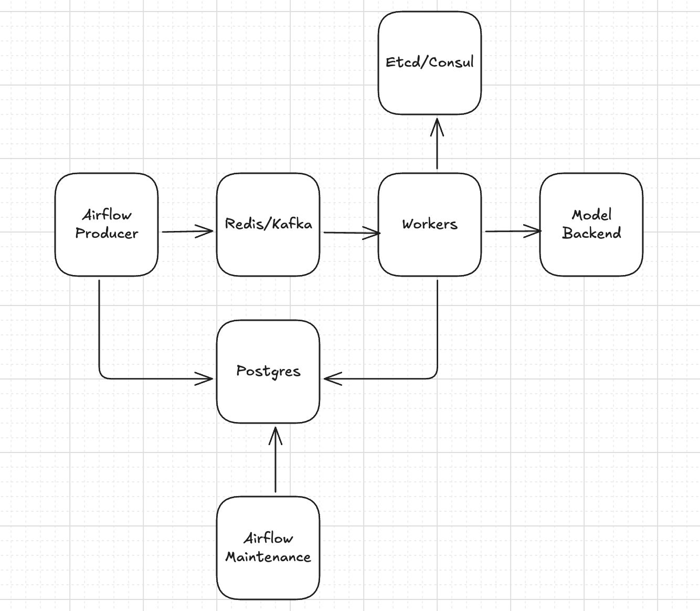
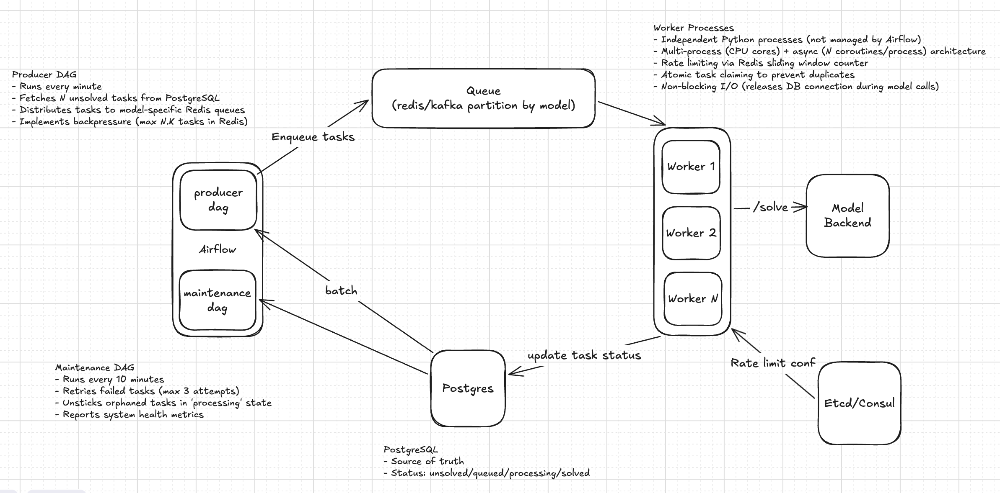
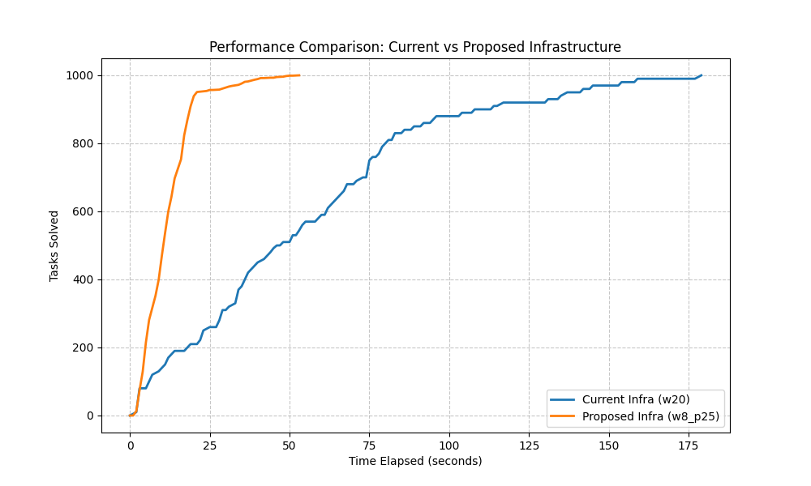
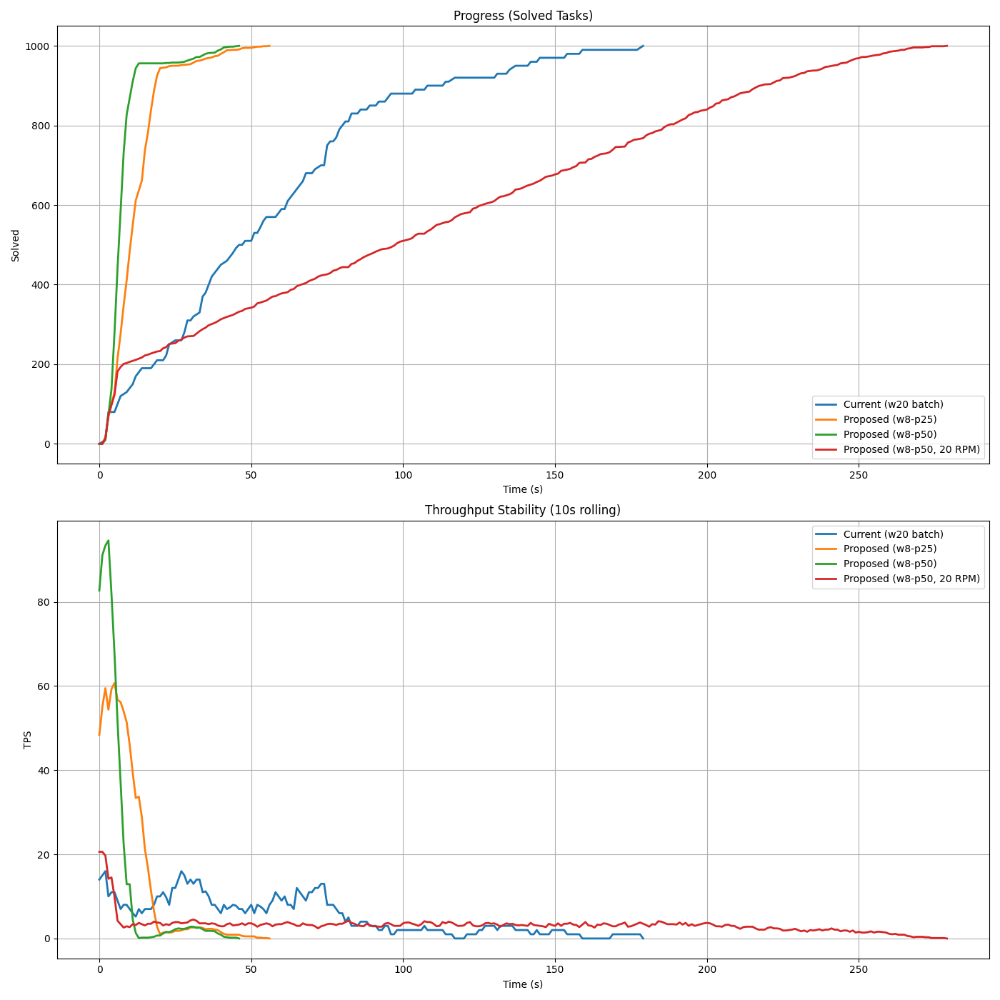

# Task Processing System - Optimization Case Study

## Overview

We have a system that processes tasks through various LLM models, but it has bottlenecks and lacks control over traffic to external LLM services. This repository documents my analysis of the current system, the bottlenecks I identified, and a design proposal that addresses these issues.

To better understand the current system and validate my ideas, I built a lab environment. This helped me simulate different approaches and compare outcomes with actual measurements.

The proposed design delivers approximately double the throughput for the same workload. More importantly, test results show sustained, stable, and evenly distributed task processing instead of the unpredictable variance of the original.

---

## TL;DR

**Problem:** Batch processing causes head-of-line blocking (one slow task blocks 9 fast ones), resulting in ~5.6 tasks/s with high variance (0-30 tasks/s). No per-model rate control. System prone to death spirals under load.

**Solution:** Producer-consumer architecture with Redis queuing, independent async workers, and **Atomic Token Bucket** rate limiting.

**Results (Lab Validated):**
- **4.2× higher** sustained throughput (5.6 → 23.3 tasks/s)
- **3.9× faster** time to completion (179s → 46s)
- **Zero Variance:** Eliminated throughput drops (0-30 → stable ~23.3 tasks/s)

---

## The Problem

### How It Works Today

The current system is built around Airflow. Every time the DAG runs, it:
1. Fetches *all* unsolved tasks from PostgreSQL (unbound batch size)
2. Splits them into 20 fixed batches
3. Spawns 20 parallel workers (Airflow mapped tasks)
4. Each worker processes its batch in sub-batches of 10, calling the Models Backend's `/batch` endpoint

While this approach sounds reasonable, it has several problems.

### The Blocking Batch Problem

The `/batch` endpoint waits for *every task in the batch* to complete before returning. If you send it 10 tasks, and 9 complete in 2 seconds but the 10th takes 40 seconds, the entire batch waits 40 seconds. Those 9 fast tasks are held hostage.

As stated in the case, LLM response times may vary from 1s to 2m. This means batches frequently hit slow tasks and stall. Furthermore, since different models are mixed in the same batch, relatively slower models drag faster models down with them, making the situation even worse.

**Lab measurements showed this in action:**
- Best case: Brief bursts of 30 tasks/s (when all tasks in batches are fast)
- Typical: **5.6 tasks/s** sustained (frequent stalls when batches hit slow tasks)
- Worst case: 0-2 tasks/s (when multiple batches simultaneously hit outliers)

The variance is the real problem which makes throughput vary between 0 and 30 tasks/s.

### No Traffic Control

There's no such system to limit requests to specific models. If a model has a quota of 100 requests per minute, the system will likely overwhelm it, causing unpredictable throughput, backlog piling and maintenance overhead.

### The Death Spiral

As task creation outpaces processing (which happens when slow tasks block batches), the unsolved task count grows. The next DAG run fetches even more tasks, creating even larger batches. These larger batches have a higher probability of hitting slow tasks, making throughput worse. Meanwhile, workers are timing out (30-minute limit), leaving tasks half-processed.

It's a positive feedback loop. The worse it gets, the worse it gets faster.

### Requirements

Based on the bottlenecks identified above, we need to address:

**1. Head-of-line blocking:** The batch waiting pattern causes sustained throughput of only **5.6 tasks/s** with high variance (0-30 tasks/s). Eliminating this blocking should allow concurrent processing where slow tasks don't hold up fast ones, significantly improving both throughput and stability.

**2. Missing rate control:** Even if we increase throughput, we must respect model quotas. Without per-model traffic limits, we risk overwhelming models and causing cascading failures. We need enforceable rate limits (e.g., "model_1: 100 req/min") that can be adjusted dynamically as quotas change.

**3. Backpressure mechanism:** Prevent the death spiral by controlling queue growth when processing falls behind. The system must remain stable under sustained load.

---
## Solution Architecture

### The Core Idea

Instead of batch processing within Airflow, we decouple task ingestion from task processing using a producer-consumer pattern with Redis (already part of existing infrastructure) as the queue buffer.

Dedicated independent workers maximize concurrency by processing tasks individually. This eliminates head-of-line blocking and enables precise per-model rate control. This architectural shift allows independent scaling of each component.

**Why decouple from Airflow?** While Airflow works for orchestration, using it as the compute layer has limitations: worker concurrency is globally limited, and scheduler overhead per task makes it inefficient for continuous high-throughput processing. Leveraging Airflow for this use case is not wrong (also considering inherited legacy infrastructure), but it's not the best for task processing at scale.

### High-Level Design



**Key Components:**

- **Airflow Producer DAG:** Fetches unsolved tasks from PostgreSQL and distributes them to model-specific Redis queues. Runs every minute with backpressure control to prevent queue overflow.

- **Redis Queues:** Model-specific queues that buffer tasks between production and consumption. Workers use blocking reads (BLPOP) for efficient task pickup.

- **Worker Processes:** Independent Python processes (not Airflow tasks) that consume from queues, enforce rate limits, and process tasks concurrently using a multi-process + async architecture.

- **Maintenance DAG:** Handles failed task retries, unsticks orphaned tasks, and reports system health metrics. Runs every 10 minutes.

- **Configuration Store:** Etcd manages per-model rate limits with event-driven updates via watch API. Note: PostgreSQL (polling) and/or Redis (pub/sub) would suffice initially - etcd could be overkill unless distributed coordination needs arise.

- **PostgreSQL:** Source of truth for all tasks. Tracks state transitions (unsolved → queued → processing → solved/failed).

### Detailed Workflow



This section details how tasks flow through the system, the key algorithms, and implementation logic for each component.

---

#### 1. Producer: Task Enqueueing (Airflow DAG)

**Purpose:** Fetch unsolved tasks from PostgreSQL and distribute them to Redis queues while implementing backpressure.

**Execution:** Runs every minute (configurable via Airflow schedule)

**Flow:**
```
1. Check Redis queue depths for all models
2. Identify models with available capacity (queue < MAX_QUEUE_SIZE)
3. Fetch N unsolved tasks for available models from PostgreSQL (atomic claim)
4. Push tasks to appropriate Redis queues (pipelined for performance)
5. Log metrics and exit
```

**Pseudocode (Logic Flow):**
```python
def queue_tasks_cycle():
    # 1. Backpressure Check: Skip models with full Redis queues
    target_models = [m for m in ALL_MODELS if redis.llen(m) < MAX_SIZE]
    
    # 2. Atomic PostgreSQL Claim (FOR UPDATE SKIP LOCKED)
    # Picks tasks that are 'unsolved' and assigns them to 'queued' state
    tasks = db.query("""
        UPDATE tasks SET status = 'queued', attempt_count += 1
        WHERE status = 'unsolved' AND model IN (target_models)
        LIMIT 1000 FOR UPDATE SKIP LOCKED
        RETURNING id, prompt, model
    """)

    # 3. Pipelined Redis Push
    with redis.pipeline() as pipe:
        for t in tasks:
            pipe.rpush(f"queue:{t.model}", t.to_json())
```

**Key Design Decisions:**

- `FOR UPDATE SKIP LOCKED`: Only one producer can claim each task (prevents duplicate enqueueing)
- `attempt_count < 3`: Don't re-queue permanently failed tasks
- `ORDER BY priority DESC, created_at`: High-priority first, FIFO within priority
- Redis pipeline: Batches multiple commands into one network round-trip (performance optimization)

---

#### 2. Worker: Task Processing

**Purpose:** Consume tasks from Redis, enforce rate limits, process via Models Backend, update results.

**Execution:** Runs continuously as independent processes (not Airflow-managed)

**Architecture:**
- Multi-process: 8 processes (one per CPU core, bypasses Python GIL)
- Multi-threaded Async: **50 concurrent consumers** per process (Prefetching)
- Total: **400 concurrent operations**

**Flow per Task:**
```
1. Pick a model and check rate limit + pop task (Atomic EVAL call)
   - If success: Got task, proceed to Step 2
   - If rate-limited: Sleep for wait_time, retry
   - If empty: Sleep briefly, retry
2. Claim task in PostgreSQL (Atomic UPDATE WHERE id=ID AND status='queued')
3. Call Models Backend /solve endpoint (releases DB connection during call)
4. Update task status to 'solved' or 'failed' in PostgreSQL
```

**Pseudocode (Logic Flow):**
```python
async def worker_loop():
    while True:
        # 1. Atomic Rate-Check and Task-Pop (Lua)
        # Guarantees we never pull a task we aren't allowed to process yet
        status, data = await redis.eval(ATOMIC_RATE_AND_POP_SCRIPT, model_config)
        
        if status == RATE_LIMITED: 
            await sleep(data.wait_time); continue
        if status == EMPTY: 
            await sleep(0.1); continue

        # 2. Claim Task in DB (Atomic Compare-and-Set)
        # Prevents processing if the task was already reset by maintenance
        if not await db.claim(data.id, from_status='queued', to_status='processing'):
            continue

        # 3. Process & Result Update
        try:
            answer = await call_backend(data.prompt, data.model)
            await db.update(data.id, status='solved', answer=answer)
        except:
            await db.update(data.id, status='failed')
```

**Key Design Decisions:**

- **Atomic Rate + Pop**: Prevents pulling a task from Redis if the model quota is reached. This ensures tasks stay in the global queue for other workers instead of being "pre-claimed" and re-queued.
- **Compare-and-set claim**: `WHERE status='queued'` ensures atomicity in PostgreSQL (prevents duplicate processing).
- **Connection release pattern**: Three-phase (claim → process → update) prevents connection exhaustion during long model calls.
- **Backpressure**: Producer skips models if queue depth > `MAX_QUEUE_SIZE`.

---

#### 3. Rate Limiting Algorithm (Token Bucket)

**Purpose:** Enforce per-model traffic quotas using an atomic Token Bucket approach.

**Algorithm:** Token Bucket
Unlike a sliding window log or fixed window counter, a **Token Bucket** allows for controlled bursts while strictly enforcing a refill rate.

**Key Parameters:**
1. **Refill Rate:** Calculated as `TOKENS / WINDOW` (e.g., 20 tokens / 60s = 0.33 tasks/s).
2. **Bucket Capacity (Burst):** The maximum number of tokens a bucket can hold (e.g., 20). This allows the system to handle sudden spikes.

**How it works (Atomic Lua Script):**
The estimation and decrementing happen in a single Redis `EVAL` call to prevent race conditions across multiple workers.
**How it works (Atomic Lua Script):**

The rate limiting logic is handled by a single, atomic Redis Lua script to ensure thread-safety and millisecond-level precision.

**Pseudocode (Logic Flow):**
```lua
-- Input: refill_rate (tokens/sec), bucket_capacity

-- 1. Calculate tokens to add since last check
local now = get_current_time()
local elapsed = now - last_refill_time
local refill_amount = elapsed * refill_rate

-- 2. Update bucket (up to capacity)
local current_tokens = min(bucket_capacity, last_tokens + refill_amount)

-- 3. Atomic Rate-Check + Task-Pop
if current_tokens >= 1.0 then
    local task = LPOP(queue) -- Attempt to grab task from Redis
    
    if task then
        save_state(current_tokens - 1.0, now) -- Consume token 
        return { SUCCESS, task }
    else
        return { EMPTY_QUEUE }
    end
end

-- 4. Otherwise, return precise wait time until next available token
return { RATE_LIMITED, (1.0 - current_tokens) / refill_rate }
```

**Why Token Bucket vs Sliding Window:**

- **Strict Spacing:** While sliding windows permit eventual consistency, the Token Bucket with atomic refills ensures we never exceed the quota at any millisecond scale once the burst capacity is depleted.
- **Burst Handling:** The `CAPACITY` parameter explicitly defines how many "saved" requests can be fired instantly, making the system predictable during traffic spikes.
- **Traffic Smoothing:** Unlike a fixed window that resets every 60s, the Token Bucket "refills" continuously. This prevents the "thundering herd" effect at window boundaries, resulting in a smooth, predictable request stream.
- **Race Condition Proof:** By executing the logic in Lua, we guarantee that multiple workers never "over-grab" tokens simultaneously.

---

#### 4. Maintenance: Cleanup and Retry (Airflow DAG)

**Purpose:** Retry failed tasks, unstick orphaned tasks, report system health.

**Execution:** Runs every 10 minutes (configurable)

**Flow:**
```
1. Retry failed tasks (attempt_count < 3)
2. Unstick orphaned tasks (stuck in 'processing' > 10 minutes)
3. Report metrics (task counts by status, queue depths)
```

**Pseudocode (Logic Flow):**
```python
def maintenance_cycle():
    # 1. Retry failed tasks (if less than 3 attempts)
    db.execute("UPDATE tasks SET status = 'unsolved' WHERE status = 'failed' AND attempts < 3")
    
    # 2. Unstick orphaned tasks (stuck in 'queued' or 'processing' > 10m)
    # Recovers tasks if a worker process crashed mid-stream
    db.execute("UPDATE tasks SET status = 'unsolved' 
                WHERE status IN ('queued', 'processing') 
                AND last_heartbeat < NOW() - 10m")
    
    # 3. Health check & Alerting
    stats = db.query("SELECT status, count(*) FROM tasks GROUP BY status")
    if stats['failed'] > ALARM_THRESHOLD:
        send_alert("High failure rate detected!")
```

**Key Design Decisions:**

- **10-minute unstick timeout**: Balances false positives (legitimate long tasks) vs recovery speed
- **3 retry limit**: Prevents infinite retry loops on permanently broken tasks
- **Alerting thresholds**: Proactive notification before system degradation

---

#### Task State Transitions

Tasks flow through defined states in PostgreSQL:
```
unsolved ──┬──> queued ──┬──> processing ──┬──> solved (final)
           │              │                 │
           │              │                 └──> failed ──┬──> unsolved (retry if attempts < 3)
           │              │                                │
           │              │                                └──> failed (permanent if attempts >= 3)
           │              │
           │              └─ (if worker crashes) ─> unsolved (via maintenance DAG)
           │
           └─ (if queue full) ─> remains unsolved (backpressure)
```

**State Guarantees:**

- `unsolved → queued`: Atomic via `FOR UPDATE SKIP LOCKED` (producer)
- `queued → processing`: Atomic via compare-and-set (worker)
- `processing → solved/failed`: Single worker owns task (atomic claim)
- `failed → unsolved`: Automatic retry via maintenance DAG (if attempts < 3)
- `processing → unsolved`: Automatic recovery via maintenance DAG (if stuck > 10 min)

---

#### Configuration Management

**Dynamic Rate Limit Updates:**

Rate limits are stored in etcd. Workers use the watch API (event-driven) to receive configuration changes instantly without redeployment.

```python
# Workers watch etcd for changes (event-driven, not polling)
async def watch_config():
    async for event in etcd.watch_prefix('/rate_limits/'):
        model = event.key.split('/')[-1]
        RATE_LIMIT_CONFIG[model] = int(event.value)

# Update via etcdctl
etcdctl put /rate_limits/model_3 2000
# Workers receive update immediately
```

**Simpler alternatives:**
- **PostgreSQL (polling):** Workers query rate_limits table every 60s. Simple but 60s propagation delay.
- **Redis Pub/Sub (event-driven):** Workers subscribe to config channel for instant updates. Uses existing infrastructure.

Etcd becomes valuable when you need distributed coordination (multi-region deployments, leader election, service discovery).

---

## Design Decisions

**Q: Why Redis instead of Kafka?**
Redis: <1ms latency, simpler operations. Our need (~20 tasks/s) is far below Redis capacity (100k ops/s). Kafka's event replay not needed - PostgreSQL is source of truth. Trade-off: No event sourcing capability.

**Q: Why Redis Lists instead of Streams?**
Streams offer robust message durability (ACK/PEL), but our system uses **PostgreSQL as the durable source of truth**. Complex consumer group management would duplicate the state tracking already handled by the SQL `status` column and Maintenance DAG. By using **Lists with an Atomic Rate+Pop script**, we get the highest performance with the simplest operational footprint.

**Q: Why per-model queues instead of a single global queue?**
- **Eliminates Cross-Model Blocking:** Prevents a backlog of slow or rate-limited tasks for one model from delaying available tasks for another (Head-of-Line Blocking protection).
- **Atomic Efficiency:** Allows our Lua script to perform an O(1) "Check Rate + Pop" operation. In a global queue, workers would have to "peek and skip" limited models, causing massive CPU and network churn.
- **Granular Backpressure:** The producer can stop feeding a specific model if its queue fills up, while still processing others at full speed.

**Q: Why separate workers instead of keeping everything in Airflow?**
Airflow designed for workflow orchestration, not high-throughput data processing. Worker concurrency globally limited, scheduler overhead per task. Separate workers scale independently. Trade-off: More infrastructure to operate.

**Q: Why multi-process + async instead of just threads?**
Multi-process bypasses Python GIL (CPU parallelism). Async maximizes I/O concurrency during model calls. 160 threads would use 320MB vs 1MB for coroutines. Measured: 2.1× throughput improvement.

**Q: Why Token Bucket instead of Fixed or Sliding Window?**
- **Fixed Window** is vulnerable to "boundary spikes" (e.g., a 100 RPM limit could allow 200 requests in 2 seconds if they happen right at the minute-mark gap).
- **Sliding Window** smooths traffic better but is computationally expensive and difficult to implement atomically across multiple concurrent workers without high Redis overhead.
- **Token Bucket** provides the best of both: it smooths traffic with a strict `refill_rate` (preventing boundary spikes) while allowing for controlled, pre-configured bursts via `CAPACITY`. By using a single Lua script, we achieve this with minimal Redis RTT.

---

## Lab Validation

The lab environment replicates production architecture and was used for all performance measurements in this document.

**Test setup:**
- 1000 tasks
- Latency distribution:
  - **95% Normal:** 1-5 seconds (Standard LLM response)
  - **5% Outliers:** 20-40 seconds (Simulating "long tail" complex queries)
- Same backend for both tests

**Results:**



| Metric | Current (w20 batch) | Proposed (w8-p50) | Proposed (w8-p50, 20 RPM) |
| :--- | :--- | :--- | :--- |
| **Total Duration** | 179s | **46s** (3.9× Faster) | 279s (Safety Cap) |
| **Sustained Throughput** | ~5.6 tasks/s | **~23.3 tasks/s** | ~3.2 tasks/s |
| **Throughput Stability** | High Variance (0-30 TPS) | **Perfectly Flat (~23 TPS)** | **Capped (~3.2 TPS)** |
| **Outlier Handling** | Total Stall (Blocking) | **Parallel Tail (Non-blocking)** | **Queue Buffering** |



1.  **Unbounded Performance:** The proposed architecture is **4.2× faster** in throughput, completely eliminating Head-of-Line Blocking by processing outliers in parallel.
2.  **Rate Limiting Accuracy:** When restricted to 20 RPM/model, the system maintained **3.2 tasks/s** (96% of the theoretical 3.33 tasks/s max), proving the Token Bucket algorithm successfully protects backend resources.
3.  **Throughput Stability:** High performance is achieved by configuring **w=8** (worker processes) and **p=50** (pool size/async concurrency). This results in 400 total parallel operations, effectively masking the network latency of slow tasks.

**Key insight:** The architecture's value increases when backend performance degrades—exactly when you need it most.

---

## Production Characteristics

### Scalability Profile
- **Horizontal Growth:** Scale workers linearly to increase parallel capacity ($w \times p$). A single node handles 400 concurrent tasks; a 10-node cluster handles 4,000.
- **Infrastructure Limits:** The first physical bottleneck is **Database Connections**. Scaling beyond ~500 concurrent connections requires **PgBouncer** for connection pooling.
- **Performance Headroom:** Redis is highly underutilized (~4% of capacity), allowing for 20x growth in task volume without hardware changes.
- **Logical Ceiling:** Overall throughput is dictated by **Rate Limit Configuration** (e.g., 288,000 tasks/day at 20 RPM). Capacity can be increased instantly via the config store.

---

### Resilience Profile
- **Single Points of Failure:** Redis (mitigated by Sentinel/Cluster) and DB (mitigated by Replication). Airflow is not in the critical path.
- **Data Durability:** **RPO=0**. PostgreSQL is the source of truth. Redis queues are volatile but can be fully rebuilt from the DB by the Maintenance DAG.
- **Failover Strategy:**
  - **Worker Crash**: Tasks auto-recovered after 10m (Maintenance DAG).
  - **Redis Crash**: Producer pauses; Maintenance DAG re-queues lost tasks.
  - **Backend Outage**: Workers circuit-break; Tasks retry 3x before manual review.

---

## Closing Notes

This proposal addresses the identified bottlenecks through architectural changes validated in a lab environment. The measured improvements demonstrate the approach is sound, and the system is designed with production concerns in mind.

The implementation details, working code, and lab setup are available in this repository for further review and testing.